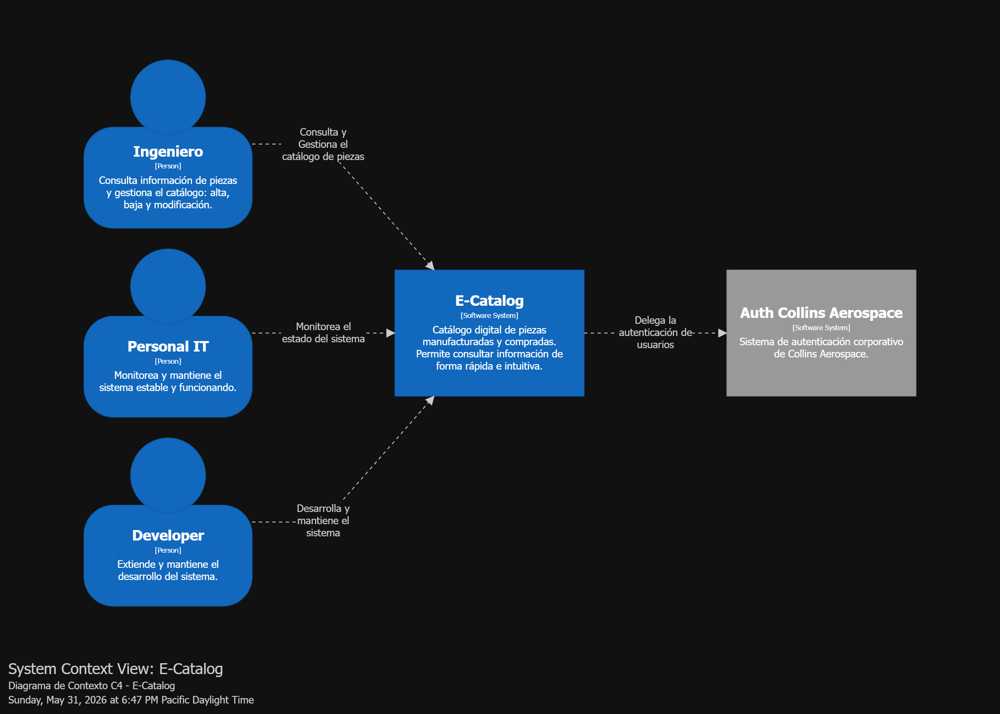
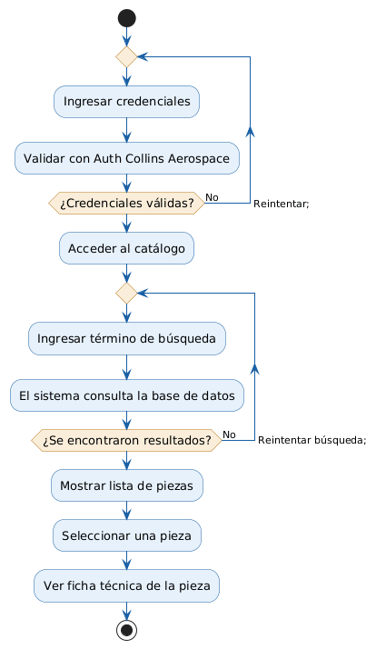

# Software Guidebook — Plantilla de Documentación

**Nombre del sistema:**   E-Catalog 

**Equipo / Integrantes:** Luis Guillen, Gibran Garcia, Carlos Valenzuela

**Fecha:** 31 - Mayo - 2026 

**Versión del documento:** Final  

---

# 1. Contexto

Esta sección establece el escenario general. Debe responder: ¿qué es el sistema? ¿por qué existe? ¿quién lo usa? ¿cómo encaja en su entorno? Una página o dos es suficiente; un diagrama de contexto (C4 Level 1) es altamente recomendado.

## ¿Qué es y para qué sirve este sistema?
Escribe aquí una descripción breve del sistema.

E-Catalog es un sistema que consiste en un catálogo digital que contiene piezas manufacturadas y compradas en la empresa Collins Aerospace con la intención de proporcionar información sobre ellas de una manera sencilla e intuitiva para el usuario, en este caso, siendo los empleados dentro de Collins Aerospace.
## ¿Cómo encaja en el entorno existente?
Describe los sistemas externos, procesos de negocio o plataformas con las que interactúa.

E-Catalog interactúa con el Sistema de Autenticación de Collins Aerospace para delegar la tarea de Autenticar usuarios, permitiéndoles el acceso a la plataforma.

## ¿Quiénes son los usuarios?

| Rol / Actor | Descripción |
|---|---|
| Ingenieros | Ingenieros que trabajan en el área de Standard Parts en Collins Aerospace |
| Personal de IT | Empleados que trabajan en el área de IT en Collins Aerospace|
| Developers |Developers que trabajan en Collins Aerospace|

## Diagrama de Contexto
Inserta aquí un diagrama C4 de Contexto (Level 1) o un esquema equivalente.



---

# 2. Vista Funcional

Resume las funcionalidades clave del sistema. No es un manual de usuario; es un mapa de lo que hace el sistema y qué funcionalidades son arquitectónicamente significativas.

## ¿Qué hace el sistema?
Describe brevemente el propósito funcional del sistema.

El propósito de E-Catalog es brindar un catálogo donde los Ingenieros en Collins Aerospace puedan consultar información y datos tanto de piezas manufacturadas como de piezas compradas. Esto con la intención de tener un acceso rápido y sencillo de navegar para la suplir la necesidad de consulta de información en el día a día del trabajo.

## Funcionalidades principales

| # | Funcionalidad | ¿Arquitectónicamente significativa? | ¿Por qué? |
|---|---|---|---|
| 1 | Búsqueda y filtrado de piezas (por número de parte, categoría, material, dimensiones, etc.) | Sí | Es el núcleo del sistema; impacta el modelo de datos, indexación y rendimiento de queries |
| 2 | Visualización de ficha técnica de pieza (especificaciones, planos, tolerancias, materiales) | Sí | Puede requerir renderizado de archivos PDF/PNG y almacenamiento de archivos pesados |
| 3 | Gestión de catálogo (alta, baja y modificación de piezas) | Sí | Define flujos de escritura, roles y permisos |
| 4 | Exportación de información de piezas (PDF, Excel) | No | Es útil pero no cambia decisiones estructurales del sistema |

## Usuarios y sus necesidades

| Rol | Necesidad principal que cubre el sistema |
|---|---|
| Ingenieros de Collins Aerospace | Utilizan el E-Catalog para consultar información de piezas manufacturadas y compradas. También gestiona el catálogo: alta, baja y modificación de piezas. |
|Personal de IT de Collins Aerospace|Revisa el estado del sistema para mantenerlo estable y funcionando|
|Developers de Collins Aerospace|Se encargan de darle continuidad al desarrollo del sistema extendiendo su funcionalidad y adaptándolo día con día|

## Diagrama de flujo / casos de uso (opcional si aplica)

Un diagrama de casos de uso UML, wireframe o diagrama de flujo de actividad puede ir aquí.

<div align="center">



</div>


---

# 3. Atributos de Calidad

Lista los requisitos no funcionales con valores precisos y medibles. Evita términos vagos como "rápido" o "escalable"; usa métricas concretas.

| Atributo | Descripción | Métrica / Criterio de aceptación |
|---|---|---|
| Rendimiento | Las búsquedas y consultas de piezas deben responder ágilmente para no interrumpir el flujo de trabajo del ingeniero | Tiempo de respuesta menor a 2 segundos en el 95% de las consultas |
| Escalabilidad | El sistema debe soportar el uso simultáneo de múltiples ingenieros dentro de la red interna | Soportar al menos 10 usuarios concurrentes sin degradación notable del rendimiento |
| Disponibilidad | El sistema debe estar disponible durante el horario laboral de Collins Aerospace | 99% de uptime en horario laboral (lunes a viernes, 7am–5pm) |
| Seguridad | El acceso al sistema debe estar restringido a empleados autenticados mediante el sistema de autenticación de Collins Aerospace | 100% de endpoints protegidos; ningún acceso sin sesión válida del sistema corporativo |
| Mantenibilidad | El código debe ser comprensible y fácil de extender por nuevos developers que se incorporen al proyecto | Un developer nuevo debe ser capaz de entender y modificar cualquier módulo del sistema en menos de 2 horas, contando con la documentación disponible |
| Usabilidad | Los ingenieros deben poder encontrar una pieza sin necesidad de capacitación previa | Un usuario nuevo debe poder realizar una búsqueda exitosa en menos de 3 minutos sin ayuda |

> **Nota:** Indica explícitamente qué atributos están fuera de alcance si aplica (ej. "Soporte multilingüe no está contemplado en esta versión").

Atributos fuera de alcance:  
- Soporte multilingüe (solo español)  
- Acceso desde fuera de la red interna (no hay acceso remoto/VPN contemplado)  
- Alta disponibilidad 24/7 fuera de horario laboral
---

# 4. Restricciones

Documenta las restricciones impuestas al proyecto: tecnológicas, organizacionales, presupuestarias, legales, etc. Las restricciones reducen opciones de diseño y deben quedar explícitas.

| Tipo | Restricción | Impacto en la arquitectura |
|---|---|---|
| Tecnológica | N/A | N/A |
| Presupuesto / Tiempo | No hay presupuesto para el proyecto. El tiempo para realizar el proyecto es de 6 meses | Obliga a usar tecnologías open source y gratuitas. El alcance funcional debe limitarse a lo esencial; descarta soluciones complejas que requieran licencias o infraestructura costosa |
| Plataforma de despliegue | El sistema debe desplegarse localmente en una máquina Windows de la empresa | Descarta opciones cloud; obliga a usar tecnologías compatibles con Windows. El sistema solo es accesible desde la red interna de la empresa |
| Equipo | Equipo de 6 personas con conocimiento que tengan conocimiento en Front-End, Back-End, Base de Datos, Diseño y Maquetado| Se debe elegir un stack tecnológico conocido por el equipo para evitar curvas de aprendizaje que comprometan los tiempos. La arquitectura debe ser simple y bien documentada para facilitar la colaboración |
| Legal / Regulatoria | N/A | N/A |

---

# 5. Principios de Diseño

Enumera los principios que guían las decisiones de arquitectura y desarrollo. Deben ser conocidos y compartidos por todo el equipo.

| # | Principio | Descripción / Justificación |
|---|---|---|
| 1 | DRY (Don't Repeat Yourself) | El código no debe duplicarse. Si una lógica se repite, se extrae en un componente o función reutilizable para facilitar el mantenimiento y reducir errores |

---

# 6. Arquitectura de Software

Esta es la vista de "gran cuadro" del sistema. Describe la estructura de contenedores y componentes principales. Usa diagramas C4 (Level 2 y/o Level 3).

## Descripción general

Explica en 2-4 párrafos la estructura del sistema: qué contenedores lo componen, qué tecnologías usan y cómo interactúan entre sí.

## Diagrama de Contenedores (C4 Level 2)

Muestra los contenedores (aplicaciones, bases de datos, servicios) y sus interacciones.

```text
[ Diagrama aquí ]
```

## Diagrama de Componentes (C4 Level 3) — opcional

Muestra los componentes internos de un contenedor relevante.

```text
[ Diagrama aquí ]
```

## Resumen de contenedores / componentes principales

| Contenedor / Componente | Tecnología | Responsabilidad |
|---|---|---|
| Ej. Web App | React + TypeScript | Interfaz de usuario |
| Ej. API REST | Node.js / Express | Lógica de negocio |
| Ej. Base de datos | PostgreSQL | Persistencia de datos |
| ... | ... | ... |

---

# 7. Código

Explica los aspectos de implementación más importantes, complejos o no obvios. No documentes todo; enfócate en lo que los nuevos integrantes del equipo necesitan entender.

## Aspectos relevantes de implementación

Para cada aspecto importante, incluye una breve descripción y, si ayuda, un diagrama de clases o de secuencia simplificado.

### 7.1 [Nombre del aspecto, ej. Manejo de autenticación]
Descripción...

### 7.2 [Nombre del aspecto, ej. Estrategia de caché]
Descripción...

### 7.3 [Nombre del aspecto, ej. Patrón de acceso a datos]
Descripción...

---

# 8. Datos

Documenta lo importante sobre los datos del sistema: modelo, almacenamiento, propietarios, retención y respaldo.

## Modelo de datos (resumen)

Incluye un diagrama entidad-relación simplificado o un esquema de alto nivel.

```text
[ Diagrama o descripción del modelo de datos aquí ]
```

## Preguntas clave sobre los datos

| Pregunta | Respuesta |
|---|---|
| ¿Dónde se almacenan los datos? | ... |
| ¿Quién es propietario de los datos? | ... |
| ¿Cuánto almacenamiento se requiere? | ... |
| ¿Estrategia de respaldo? | ... |
| ¿Requisitos de archivado o retención? | ... |
| ¿Se usan archivos planos? ¿En qué formato? | ... |

---

# 9. Arquitectura de Infraestructura

Describe el hardware (físico o virtual) y la red sobre la que correrá el software.

## Diagrama de infraestructura / red

```text
[ Diagrama aquí ]
```

## Descripción de componentes de infraestructura

| Componente | Tipo | Descripción / Propósito |
|---|---|---|
| Ej. Servidor Web | VM / Cloud | ... |
| Ej. Servidor de BD | VM / Cloud | ... |
| Ej. Load Balancer | ... | ... |

## Consideraciones de alta disponibilidad

¿Se contempla redundancia, failover o disaster recovery? ¿Cómo?

---

# 10. Despliegue

Documenta el mapeo entre los contenedores de software y la infraestructura. ¿Dónde corre cada pieza del sistema?

## Estrategia de despliegue

Describe cómo y dónde se despliega el sistema (ej. contenedores Docker en AWS ECS, despliegue manual en VPS, etc.).

## Mapeo software → infraestructura

| Contenedor / Componente | Se despliega en | Configuración (activo/pasivo, réplicas, etc.) |
|---|---|---|
| ... | ... | ... |
| ... | ... | ... |

## Estrategia de rollback

¿Cómo se revierte un despliegue fallido?

---

# 11. Operación y Soporte

Explica cómo se monitorea, administra y mantiene el sistema en producción.

| Aspecto | Descripción |
|---|---|
| Monitoreo | ¿Qué herramientas se usan? ¿Qué métricas se observan? |
| Logs / Auditoría | ¿Dónde se almacenan? ¿Qué se registra? |
| Alertas | ¿Bajo qué condiciones se generan alertas? |
| Tareas de mantenimiento | ¿Hay tareas manuales periódicas? |
| Cambios de configuración | ¿Requieren reinicio? ¿Cómo se gestionan? |

---

# 12. Entorno de Desarrollo

Proporciona toda la información práctica que un desarrollador nuevo necesita para comenzar a trabajar.

## Requisitos previos

| Herramienta | Versión requerida | Notas |
|---|---|---|
| Ej. Node.js | >= 20.x | ... |
| Ej. Docker | >= 24.x | ... |
| ... | ... | ... |

## Cómo clonar y configurar el proyecto

```bash
# Ejemplo:
git clone https://github.com/tu-org/tu-repo.git
cd tu-repo

# Pasos de configuración...
```

## Cómo ejecutar el proyecto localmente

```bash
# Comando(s) para levantar el sistema en desarrollo
```

## Cómo ejecutar las pruebas

```bash
# Comando(s) para ejecutar el suite de pruebas
```

## Estructura de ramas / flujo de trabajo Git

Describe brevemente el flujo (ej. Gitflow, trunk-based development, etc.).

---

# 13. Registro de Decisiones

Documenta las decisiones de arquitectura importantes: qué se decidió, por qué y qué alternativas se descartaron. Esto previene que el equipo repita discusiones ya resueltas.

| # | Decisión | Contexto / Problema | Alternativas consideradas | Justificación |
|---|---|---|---|---|
| 1 | Ej. Usar PostgreSQL como base de datos | ... | MySQL, MongoDB | ... |
| 2 | ... | ... | ... | ... |
| 3 | ... | ... | ... | ... |

---

Plantilla basada en el Software Guidebook de Simon Brown — *"Visualise, Document and Explore your Software Architecture"* (Part II: Document).
````
