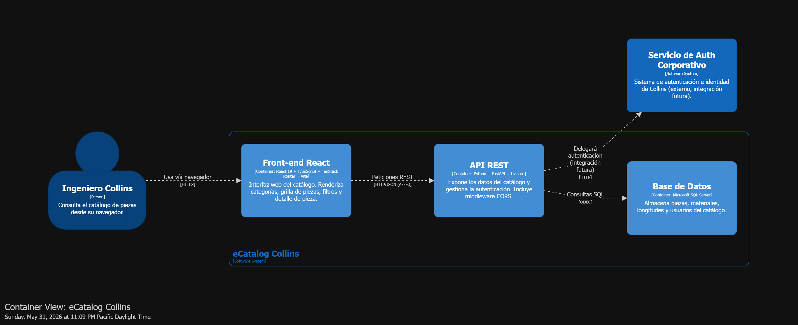
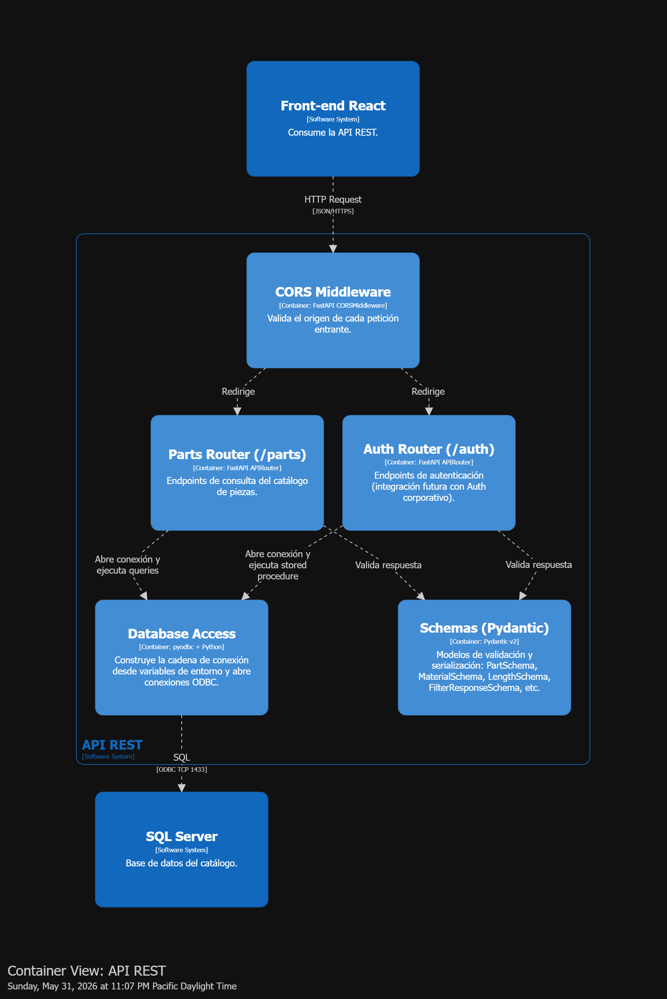
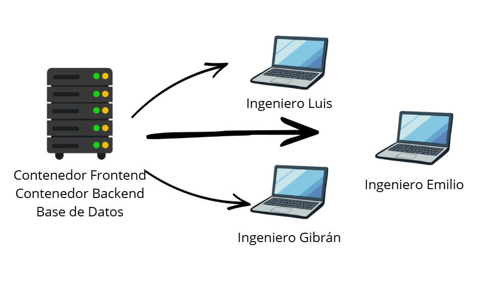

# Software Guidebook — Plantilla de Documentación

**Nombre del sistema:**   E-Catalog 

**Equipo / Integrantes:** Luis Guillen, Gibran Garcia, Carlos Valenzuela

**Fecha:** 31 - Mayo - 2026 

**Versión del documento:** Final  

---

# 1. Contexto

Esta sección establece el escenario general. Debe responder: ¿qué es el sistema? ¿por qué existe? ¿quién lo usa? ¿cómo encaja en su entorno? Una página o dos es suficiente; un diagrama de contexto (C4 Level 1) es altamente recomendado.

## ¿Qué es y para qué sirve este sistema?
Escribe aquí una descripción breve del sistema.

E-Catalog es un sistema que consiste en un catálogo digital que contiene piezas manufacturadas y compradas en la empresa Collins Aerospace con la intención de proporcionar información sobre ellas de una manera sencilla e intuitiva para el usuario, en este caso, siendo los empleados dentro de Collins Aerospace.
## ¿Cómo encaja en el entorno existente?
Describe los sistemas externos, procesos de negocio o plataformas con las que interactúa.

E-Catalog interactúa con el Sistema de Autenticación de Collins Aerospace para delegar la tarea de Autenticar usuarios, permitiéndoles el acceso a la plataforma.

## ¿Quiénes son los usuarios?

| Rol / Actor | Descripción |
|---|---|
| Ingenieros | Ingenieros que trabajan en el área de Standard Parts en Collins Aerospace |
| Personal de IT | Empleados que trabajan en el área de IT en Collins Aerospace|
| Developers |Developers que trabajan en Collins Aerospace|

## Diagrama de Contexto
Inserta aquí un diagrama C4 de Contexto (Level 1) o un esquema equivalente.


---

# 2. Vista Funcional

Resume las funcionalidades clave del sistema. No es un manual de usuario; es un mapa de lo que hace el sistema y qué funcionalidades son arquitectónicamente significativas.

## ¿Qué hace el sistema?
Describe brevemente el propósito funcional del sistema.

El propósito de E-Catalog es brindar un catálogo donde los Ingenieros en Collins Aerospace puedan consultar información y datos tanto de piezas manufacturadas como de piezas compradas. Esto con la intención de tener un acceso rápido y sencillo de navegar para la suplir la necesidad de consulta de información en el día a día del trabajo.

## Funcionalidades principales

| # | Funcionalidad | ¿Arquitectónicamente significativa? | ¿Por qué? |
|---|---|---|---|
| 1 | Búsqueda y filtrado de piezas (por número de parte, categoría, material, dimensiones, etc.) | Sí | Es el núcleo del sistema; impacta el modelo de datos, indexación y rendimiento de queries |
| 2 | Visualización de ficha técnica de pieza (especificaciones, planos, tolerancias, materiales) | Sí | Puede requerir renderizado de archivos PDF/PNG y almacenamiento de archivos pesados |
| 3 | Gestión de catálogo (alta, baja y modificación de piezas) | Sí | Define flujos de escritura, roles y permisos |
| 4 | Exportación de información de piezas (PDF, Excel) | No | Es útil pero no cambia decisiones estructurales del sistema |

## Usuarios y sus necesidades

| Rol | Necesidad principal que cubre el sistema |
|---|---|
| Ingenieros de Collins Aerospace | Utilizan el E-Catalog para consultar información de piezas manufacturadas y compradas. También gestiona el catálogo: alta, baja y modificación de piezas. |
|Personal de IT de Collins Aerospace|Revisa el estado del sistema para mantenerlo estable y funcionando|
|Developers de Collins Aerospace|Se encargan de darle continuidad al desarrollo del sistema extendiendo su funcionalidad y adaptándolo día con día|

## Diagrama de flujo / casos de uso (opcional si aplica)

Un diagrama de casos de uso UML, wireframe o diagrama de flujo de actividad puede ir aquí.

<div align="center">


</div>


---

# 3. Atributos de Calidad

Lista los requisitos no funcionales con valores precisos y medibles. Evita términos vagos como "rápido" o "escalable"; usa métricas concretas.

| Atributo | Descripción | Métrica / Criterio de aceptación |
|---|---|---|
| Rendimiento | Las búsquedas y consultas de piezas deben responder ágilmente para no interrumpir el flujo de trabajo del ingeniero | Tiempo de respuesta menor a 2 segundos en el 95% de las consultas |
| Escalabilidad | El sistema debe soportar el uso simultáneo de múltiples ingenieros dentro de la red interna | Soportar al menos 10 usuarios concurrentes sin degradación notable del rendimiento |
| Disponibilidad | El sistema debe estar disponible durante el horario laboral de Collins Aerospace | 99% de uptime en horario laboral (lunes a viernes, 7am–5pm) |
| Seguridad | El acceso al sistema debe estar restringido a empleados autenticados mediante el sistema de autenticación de Collins Aerospace | 100% de endpoints protegidos; ningún acceso sin sesión válida del sistema corporativo |
| Mantenibilidad | El código debe ser comprensible y fácil de extender por nuevos developers que se incorporen al proyecto | Un developer nuevo debe ser capaz de entender y modificar cualquier módulo del sistema en menos de 2 horas, contando con la documentación disponible |
| Usabilidad | Los ingenieros deben poder encontrar una pieza sin necesidad de capacitación previa | Un usuario nuevo debe poder realizar una búsqueda exitosa en menos de 3 minutos sin ayuda |

> **Nota:** Indica explícitamente qué atributos están fuera de alcance si aplica (ej. "Soporte multilingüe no está contemplado en esta versión").

Atributos fuera de alcance:  
- Soporte multilingüe (solo español)  
- Acceso desde fuera de la red interna (no hay acceso remoto/VPN contemplado)  
- Alta disponibilidad 24/7 fuera de horario laboral
---

# 4. Restricciones

Documenta las restricciones impuestas al proyecto: tecnológicas, organizacionales, presupuestarias, legales, etc. Las restricciones reducen opciones de diseño y deben quedar explícitas.

| Tipo | Restricción | Impacto en la arquitectura |
|---|---|---|
| Tecnológica | Uso de SQL Server | Limita la elección de DBMS y obliga a usar patrones y herramientas específicas de SQL Server. Reduce portabilidad futura pero aprovecha licencias corporativas existentes. |
| Presupuesto / Tiempo | No hay presupuesto para el proyecto. El tiempo para realizar el proyecto es de 6 meses | Obliga a usar tecnologías open source y gratuitas. El alcance funcional debe limitarse a lo esencial; descarta soluciones complejas que requieran licencias o infraestructura costosa |
| Plataforma de despliegue | El sistema debe desplegarse localmente en una máquina Windows de la empresa | Descarta opciones cloud; obliga a usar tecnologías compatibles con Windows. El sistema solo es accesible desde la red interna de la empresa |
| Equipo | Equipo de 6 personas con conocimiento que tengan conocimiento en Front-End, Back-End, Base de Datos, Diseño y Maquetado| Se debe elegir un stack tecnológico conocido por el equipo para evitar curvas de aprendizaje que comprometan los tiempos. La arquitectura debe ser simple y bien documentada para facilitar la colaboración |
| Legal / Regulatoria | N/A | N/A |

---

# 5. Principios de Diseño

Enumera los principios que guían las decisiones de arquitectura y desarrollo. Deben ser conocidos y compartidos por todo el equipo.

| # | Principio | Descripción / Justificación |
|---|---|---|
| 1 | DRY (Don't Repeat Yourself) | El código no debe duplicarse. Si una lógica se repite, se extrae en un componente o función reutilizable para facilitar el mantenimiento y reducir errores |

---

# 6. Arquitectura de Software

Vista del cuadro del sistema. Descripción de la estructura de contenedores y componentes principales con diagramas C4 Nivel 2 y 3.

## Descripción general

El sistema eCatalog Collins está compuesto por tres contenedores principales que interactúan entre sí en una arquitectura de tres capas. El front-end es una Single Page Application construida con React sobre el framework TanStack Start. Toda la comunicación con el servidor ocurre a través de peticiones HTTP mediante la librería Axios con la URL base leída de una variable de entorno.
El back-end es una API REST construida con FastAPI de Python, servida por Uvicorn. Expone dos grupos de endpoints, siendo el /parts para consulta y filtrado del catálogo, y /auth para autenticación de usuarios, aunque este último solo es una medida temporal en lo que se implementa la verdadera autenticación por parte de un servicio interno de Collins que implementarán cuando se les entregue el proyecto. El middleware de CORS está configurado en la capa de entrada para controlar los orígenes permitidos. Toda la lógica de acceso a datos se realiza con consultas SQL directas.
La base de datos es una instancia de Microsoft SQL Server alojada en un servidor dedicado de la empresa. Almacena la información central del catálogo, con tablas como Parts, Materials, Lengths, y las tablas de relación Parts_Materials y Parts_Lengths. El back-end se conecta a ella mediante ODBC Driver 18 for SQL Server, usando credenciales y parámetros configurados por variables de entorno.
El módulo de autenticación existe en el código pero como se menciono, actualmente solo es un mock, en producción será reemplazado por el servicio de identidad corporativo de Collins, que se integrará con el endpoint /auth existente de la API.

## Diagrama de Contenedores (C4 Level 2)

Muestra los contenedores (aplicaciones, bases de datos, servicios) y sus interacciones.



## Diagrama de Componentes (C4 Level 3) — opcional



## Resumen de contenedores / componentes principales

| Contenedor / Componente | Tecnología | Responsabilidad |
|---|---|---|
| Front-end React | React 19 + TypeScript + TanStack Router + Vite | Interfaz de usuario, con navegación por categorías, grilla de piezas con filtros y vista de detalle |
| API REST | Python + FastAPI + Uvicorn | Punto de entrada de toda la lógica de negocio, se registran routers y configura CORS |
| CORS Middleware | FastAPI  | Controla qué orígenes pueden consumir la API |
| Parts Router (/parts) | Parts Router (/parts) | Endpoints GET /all, GET /filter, GET /{part_id} para consultar el catálogo |
| Auth Router (/auth) | FastAPI APIRouter | Endpoint de test de BD y autenticación |
| Database Access | pyodbc + ODBC Driver 18 | Construye cadena de conexión desde env vars, abre y cierra conexiones SQL Server |
| Schemas Pydantic | Pydantic v2 | Validación y serialización de respuestas con PartSchema, MaterialSchema, LengthSchema, FilterResponseSchema |
| Base de Datos | Microsoft SQL Server | Almacena Parts, Materials, Lengths, Parts_Materials, Parts_Lengths, usuarios |

---

# 7. Código

Explicación de aspectos de implementación más importantes, complejos o no obvios. 
## Aspectos relevantes de implementación

Para cada aspecto importante, incluye una breve descripción y, si ayuda, un diagrama de clases o de secuencia simplificado.

### 7.1 Acceso a datos en el back-end
El back-end no usa ORM. Cada endpoint abre su propia conexión, ejecuta SQL crudo y la cierra al terminar. La función get_connection() en app/db/database.py construye la cadena de conexión ODBC leyendo variables de entorno (DB_SERVER, DB_NAME, DB_USER, DB_PASSWORD, etc.), lo que permite cambiar el servidor de base de datos sin tocar código.
Hay un detalle importante en GET /parts/filter, donde la query SQL se construye dinámicamente con WHERE 1=1 e ifs que agregan cláusulas según los filtros recibidos. Los valores van siempre como parámetros posicionales para evitar inyección SQL; nunca se interpolan directamente en el string de la query.

### 7.2 Carga de datos
El proyecto usa dos patrones distintos para obtener datos de la API dependiendo de la necesidad. 
Loader (datos estáticos por ruta) — usado en la página de detalle de pieza. TanStack Router ejecuta la función loader antes de renderizar el componente, hace GET /parts/{partId} y valida que la pieza pertenezca a la categoría del URL. Si la pieza no existe o no corresponde, lanza notFound() automáticamente. El componente recibe los datos ya listos mediante Route.useLoaderData(), sin estados de carga ni efectos.
useEffect (datos reactivos a filtros) — usado en la página de catálogo por categoría. Los filtros como material, longitud o sistema de medición son estados local de React. Cada vez que el usuario cambia un filtro, el useEffect se dispara y hace GET /parts/filter con los parámetros actuales. Este patrón maneja explícitamente los estados loading y error.

### 7.3 Sistema de autenticación en modo mock
Aunque ya ha sido mencionado, es bueno saber que el tema de la autenticación no es la final que se querrá implementar en Collins, es por eso que se tomó la consideración de que en src/lib/auth-api.ts existe la bandera const isMock = true. Cuando está activa, las funciones login, signup y getMe nunca hacen peticiones HTTP; en su lugar generan un usuario ficticio en memoria y lo persisten en localStorage. Cuando se integre el servicio corporativo de Collins, el único cambio necesario es poner isMock = false y asegurarse de que el backend exponga los endpoints POST /auth/login, POST /auth/signup y GET /auth/me con el contrato que ya espera el cliente. El estado de sesión vive en AuthContext y se inicializa desde localStorage al montar la app para que el usuario no pierda la sesión al refrescar la página.

---

# 8. Datos

Documentación sobre los datos del sistema: modelo, almacenamiento, propietarios, retención y respaldo.

## Modelo de datos (resumen)

Diagrama de Entidad-Relación para la Base de Datos de Catalogo de Piezas de Collins


El diagrama muestra en general el comportamiento de las entidades de datos, siendo la sección principal lo de las partes con todos sus tipos de datos requeridos para cada pieza. Adicionalmente se encuentran tablas de relación, que permiten relacionar a las piezas con multiples tipos de materiales y tamaños de las mismas. Fuera de estas puede sentirse extraña la sección de usuarios al estar separada de lo demás, pero esta parte es principalmente una conveniencia de pruebas para nosotros, ya que después de que entregmos el proyecto el propio equipo de Collins serán los responsables de integrar su sistema de usuarios a la página.


## Preguntas clave sobre los datos

| Pregunta | Respuesta |
|---|---|
| ¿Dónde se almacenan los datos? | Los datos van a ser almacenados en un servidor dentro de la empresa en SQL con los datos esenciales de las piezas, aunque algunos datos serán sacados de fuera de este servidor, como los la autenticación de usuarios y los PDFs de las piezas que no sean internas. |
| ¿Quién es propietario de los datos? | A nivel general los propietarios de los datos son el propio Collins ya que los datos estarán almacenados en sus servidores. Aunque a nivel particular sería el administrador del servidaor, siendo en este caso Erick Estrada. |
| ¿Cuánto almacenamiento se requiere? | Ya que no se van a almacenar PDFs dentro de la base de datos, no es necesario demasiado por parte de Collins y se tiene previsto unos cuantos GBs, aproximadamente siendo unos 40. |
| ¿Estrategia de respaldo? | A nivel empresa normalmente respaldan los datos de sus bases de datos de SQL en .bak todos los días automáticamente, por lo que no sería muy diferente con este mismo proyecto para dichos respaldos. Para el lado de la Aplicación como tal se estaría subiendo a Azure para su control de versiones. |
| ¿Requisitos de archivado o retención? | Ya que la propia naturaleza de nuestro proyecto es el de ser un catalogo con las piezas de la empresa, estas se mantendrán dentro del catalogo por periodos indefinidos, pues siempre se utilizarán las mismas piezas para los diseños, y en caso de actualizar una para sistutuir un modelo antiguo, este mismo se convertira en un modelo Legacy y se seguirá manteniendo en el catalogo. |
| ¿Se usan archivos planos? ¿En qué formato? | No, todos los datos van a ser almacenados en la base de datos o serán sacados de otros lados como los PDFs de links de otras páginas. |

---

# 9. Arquitectura de Infraestructura

Descripción del hardware (físico o virtual) y la red sobre la que correrá el software.

## Diagrama de infraestructura / red


## Descripción de componentes de infraestructura

| Componente | Tipo | Descripción / Propósito |
|---|---|---|
|Equipo de Ingeniero | Cliente (navegador) | Dispositivo desde el cual el usuario accede al catálogo por un navegador web, no requieriendo instalación adicional. |
| Windows Server | Servidor físico — Windows Server | Aloja los archivos del build de React del front-end y actúa como reverse proxy hacia la API de FastAPI que corre en el mismo servidor bajo Uvicorn. |
| API FastAPI| Proceso en Servidor Windows | Proceso Python que expone los endpoints REST del catálogo. Incluye el middleware de CORS para permitir las peticiones del front-end. Se comunica con la BD vía ODBC Driver 18 for SQL Server. |
|Servidor de Base de Datos| Servidor físico dedicado — Red interna de Collins | Máquina dedicada de la empresa que aloja la instancia de Microsoft SQL Server con la base de datos eCatalogCollins. Solo accesible dentro de la red interna corporativa. |
| Middleware CORS| Componente lógico (FastAPI) | Configurado en la API para controlar qué orígenes pueden consumir los endpoints.  |
| Servicio de Autenticación | Externo a cargo de Collins | El módulo de usuarios fue desarrollado pero la gestión de identidades en producción será responsabilidad del equipo de TI de Collins, quien lo integrará con su directorio corporativo existente. |

## Consideraciones de alta disponibilidad

La página se planea dejar en manos de los ingenieros de Collins para su implementación con las regulaciones usuales que tegan en mente para este tipo de proyectos, pero antes de entregarlo tenemos el dato de que la propia Collins mantendrá un backup diario de todos los datos que se vayan registrando de la base. Esto no garantiza un recovery completo, pero por la propia naturaleza de la página, la cual esta destinada a ser un lugar de consulta, no es necesario un recovery exhaustivo de datos ya que poco o nada cambiara constantemenete en los datos de las piezas.

---

# 10. Despliegue

Documenta el mapeo entre los contenedores de software y la infraestructura. ¿Dónde corre cada pieza del sistema? El sistema corre en un servidor web local que se tiene en la planta de Mexicali, donde se ejectuan simultaneamente el frontend, el backend y la base de datos, debido a que es un proyecto interno y la carga que tiene planeada recibir es baja/media.




## Estrategia de despliegue

Describe cómo y dónde se despliega el sistema (ej. contenedores Docker en AWS ECS, despliegue manual en VPS, etc.).
El sistema se despliega en una máquina Windows ubicada físicamente dentro de la red de la planta. El acceso remoto para administración es vía **RDP**; para ejecución de comandos se usa PowerShell desde esa misma sesión.

El proceso es manual y controlado por el administrador del servidor.

El flujo estándar para cada actualización es el siguiente:

1. Los cambios se consolidan en la rama `main` del repositorio Git
2. El administrador notifica a los usuarios que habrá una ventana de mantenimiento 
3. Se toma un backup de la base de datos antes de cualquier intervención
4. El administrador accede al servidor vía RDP y ejecuta el pase a producción desde una terminal PowerShell
5. Se verifica que el sistema responda correctamente antes de cerrar la ventana de mantenimiento

```powershell
# ── 1. Obtener últimos cambios ──────────────────────────────────────────
cd C:\inetpub\eCatalogApp
git pull origin main

# ── 2. Build del frontend ───────────────────────────────────────────────
cd eCatalogCollinsFront
pnpm install
pnpm run build
# El resultado queda en eCatalogCollinsFront\dist\ — IIS sirve esta carpeta

# ── 3. Actualizar dependencias del backend ──────────────────────────────
cd ..\eCatalogCollinsBack
pip install -r requirements.txt

# ── 4. Correr migraciones (si las hay en este pase) ─────────────────────
# Solo ejecutar si el pase incluye cambios de esquema
alembic upgrade head

# ── 5. Reiniciar el servicio FastAPI ────────────────────────────────────
uvicorn app.main:app --reload

# ── 6. Verificar que el proceso levantó correctamente ───────────────────
Start-Sleep -Seconds 5
Invoke-WebRequest -Uri http://localhost:8000/health -UseBasicParsing
```

IIS no necesita reiniciarse salvo que cambien archivos de configuración (`.web.config`). Al actualizar la carpeta `dist\` del frontend, IIS sirve los nuevos archivos de forma inmediata.

## Mapeo software → infraestructura

| Contenedor / Componente | Se despliega en | Configuración |
|---|---|---|
| Frontend (React + TanStack Start) | `C:\inetput\eCatalogCollinsFront` | Build estático servido por Nginx for IIS; se genera con `npm run build` antes del pase |
| Backend (FastAPI) | `C:\inetpub\eCatalogCollinsBack` | Proceso Python registrado como servicio Windows vía NSSM; Uvicorn escuchando en `localhost:8000` |
| Base de datos | SQL Server, misma máquina | Instancia única, sin réplica |
| Archivos estáticos / uploads | `C:\uploads` o carpeta equivalente | Excluida del repositorio Git, respaldo manual |
| Servidor web / reverse proxy | IIS o Nginx for Windows en puerto 80/443 | Redirige `/api/*` al proceso FastAPI en `:8000` y sirve el build del frontend para todo lo demás |
## Estrategia de rollback

¿Cómo se revierte un despliegue fallido?

Si el despliegue produce un error que no se puede resolver en menos de 15 minutos, se ejecuta rollback inmediato al último estado estable conocido.

**Criterio de activación:** si tras el pase se reportan errores funcionales por usuarios de piso o supervisores en los primeros 30 minutos, se revierte sin necesidad de diagnóstico extenso. Es preferible revertir y analizar el problema en staging que mantener el sistema inestable durante turno productivo.

El procedimiento completo de rollback es el siguiente:

```powershell
# ── 1. Revertir el código al commit anterior ────────────────────────────
cd C:\inetpub\eCatalogCollinsApp
git log --oneline -5                        # identificar el hash estable
git checkout 

# ── 2. Reconstruir el frontend ──────────────────────────────────────────
cd eCatalogCollinsFrontend
pnpm install
pnpm run build

# ── 3. Restaurar dependencias del backend ───────────────────────────────
cd ..\eCatallogCollinsBack
pip install -r requirements.txt

# ── 4. Revertir migraciones si el pase las incluyó ──────────────────────
# Omitir este paso si el pase no tocó la base de datos
alembic downgrade -1

# ── 5. Reiniciar el servicio y verificar ────────────────────────────────
uvicorn app.main:app --reload
Start-Sleep -Seconds 5
Invoke-WebRequest -Uri http://localhost:8000/health -UseBasicParsing
```

> **Importante:** si `alembic downgrade` falla o el esquema quedó en un estado inconsistente, restaurar el backup tomado al inicio del pase antes de continuar:
>
> ```powershell
> # SQL Server
> sqlcmd -S localhost -Q "RESTORE DATABASE nombre_db FROM DISK='C:\backups\pre-deploy-YYYYMMDD_HHMM.bak' WITH REPLACE"
>
> # MySQL
> mysql -u usuario -p nombre_db < C:\backups\pre-deploy-YYYYMMDD_HHMM.sql
> ```

---

# 11. Operación y Soporte

Explica cómo se monitorea, administra y mantiene el sistema en producción.

| Aspecto | Descripción |
|---|---|
| Monitoreo | El estado del servicio FastAPI se verifica manualmente accediendo al endpoint `/health` desde el navegador o con `Invoke-WebRequest -Uri http://localhost:8000/health`. El administrador revisa que IIS y el servicio Windows de FastAPI estén activos desde el Administrador de servicios (`services.msc`) al inicio de cada turno. |
| Logs / Auditoría | FastAPI escribe logs en `C:\inetpub\eCatallogApp\eCatallogCollinsBack\logs\app.log` mediante el módulo `logging` de Python. IIS genera sus propios logs de acceso en `C:\inetpub\logs\LogFiles\`. Ambos se conservan por 90 días antes de rotarse o eliminarse manualmente. |
| Alertas | No se cuenta con un sistema de alertas automático. Si el servicio cae, los usuarios de piso lo reportan directamente a TI.|
| Tareas de mantenimiento | Limpiar la carpeta `C:\backups\` manualmente cada mes para evitar que llene el disco. Verificar que el servicio FastAPI arrancó correctamente después de cualquier reinicio del equipo o actualización de Windows. |
| Cambios de configuración | Las variables de entorno de FastAPI se gestionan en un archivo `.env` ubicado en `C:\inetpub\eCatallogCollinsApp\eCatallogCollinsBack`. Cualquier cambio en ese archivo requiere reiniciar el servicio (`uvicorn app.main:app --reload`) para que tome efecto. Los cambios en la configuración de IIS (bindings, URL Rewrite, app pool) no requieren reinicio del equipo pero sí un `iisreset /noforce`. |

---

# 12. Entorno de Desarrollo

Proporciona toda la información práctica que un desarrollador nuevo necesita para comenzar a trabajar.

## Requisitos previos

| Herramienta | Versión requerida | Notas |
|---|---|---|
| Node.js | >= 20.x | Instalar con pnpm por cuestiones de seguridad con npm |
| Windows | >= 10 | N/A |
| Python | >= 3.14 | N/A |
| SQL Server | >= SQL SERVER 2022 | N/A |
| UV | >= 0.11.17 | Como node.js pero para python |

## Cómo clonar y configurar el proyecto

Empezar con la base de datos
1. Levantar una instancia de SQL Server de manera local o mediante un contenedor de Docker utilizando el puerto por defecto (`1433`).
2. Abrir tu herramienta de gestión de bases de datos (SQL Server Management Studio o Azure Data Studio) y conectarse al servidor.
3. Ejecutar el siguiente bloque de comandos unificado para estructurar la base de datos, aplicar restricciones, índices, procedimientos almacenados y cargar la información semilla para pruebas:

```sql
-- ============================================================================
-- 1. CREACIÓN E INICIALIZACIÓN DE LA BASE DE DATOS
-- ============================================================================
CREATE DATABASE eCatalogCollins;
GO

USE eCatalogCollins;
GO

-- ============================================================================
-- 2. CREACIÓN DE TABLAS PRINCIPALES
-- ============================================================================

-- Tabla de Usuarios de la Aplicación
CREATE TABLE Users (
    ID INT IDENTITY(1,1) CONSTRAINT PK_Users PRIMARY KEY,
    Nombre NVARCHAR(100) NOT NULL,
    Correo NVARCHAR(150) NOT NULL CONSTRAINT UQ_Users_Correo UNIQUE,
    Rol NVARCHAR(50) NOT NULL,
    Fecha_Creacion DATETIME DEFAULT GETDATE()
);

-- Tabla de Catálogo de Materiales
CREATE TABLE Materials (
    ID INT IDENTITY(1,1) CONSTRAINT PK_Materials PRIMARY KEY,
    Name NVARCHAR(100) NOT NULL,
    Description NVARCHAR(MAX) NULL
);

-- Tabla de Catálogo de Longitudes
CREATE TABLE Lengths (
    ID INT IDENTITY(1,1) CONSTRAINT PK_Lengths PRIMARY KEY,
    Display_Value NVARCHAR(50) NOT NULL,
    System NVARCHAR(50) NOT NULL
);

-- Tabla Principal de Componentes (Parts)
CREATE TABLE Parts (
    ID INT IDENTITY(1,1) CONSTRAINT PK_Parts PRIMARY KEY,
    Spec_IP NVARCHAR(100) NULL,
    Name NVARCHAR(150) NOT NULL,
    Part_Number NVARCHAR(100) NOT NULL CONSTRAINT UQ_Parts_Part_Number UNIQUE,
    Description NVARCHAR(MAX) NULL,
    Part_Family_Type NVARCHAR(100) NULL,
    Category NVARCHAR(100) NULL,
    Features NVARCHAR(MAX) NULL,
    Size_Range NVARCHAR(100) NULL,
    Finish NVARCHAR(100) NULL,
    Visual NVARCHAR(MAX) NULL,
    Datasheet_Spec NVARCHAR(MAX) NULL
);
GO

-- ============================================================================
-- 3. CREACIÓN DE TABLAS PUENTE (RELACIONES MUCHOS A MUCHOS)
-- ============================================================================

-- Relación Muchos a Muchos: Parts <-> Materials
CREATE TABLE Parts_Materials (
    Part_ID INT NOT NULL,
    Material_ID INT NOT NULL,
    CONSTRAINT PK_Parts_Materials PRIMARY KEY (Part_ID, Material_ID),
    CONSTRAINT FK_Parts_Materials_Parts FOREIGN KEY (Part_ID) REFERENCES Parts(ID) ON DELETE CASCADE,
    CONSTRAINT FK_Parts_Materials_Materials FOREIGN KEY (Material_ID) REFERENCES Materials(ID) ON DELETE CASCADE
);

-- Relación Muchos a Muchos: Parts <-> Lengths
CREATE TABLE Parts_Lengths (
    Part_ID INT NOT NULL,
    Length_ID INT NOT NULL,
    CONSTRAINT PK_Parts_Lengths PRIMARY KEY (Part_ID, Length_ID),
    CONSTRAINT FK_Parts_Lengths_Parts FOREIGN KEY (Part_ID) REFERENCES Parts(ID) ON DELETE CASCADE,
    CONSTRAINT FK_Parts_Lengths_Lengths FOREIGN KEY (Length_ID) REFERENCES Lengths(ID) ON DELETE CASCADE
);
GO

-- ============================================================================
-- 4. CREACIÓN DE ÍNDICES DE RENDIMIENTO
-- ============================================================================

-- Optimización de búsquedas y filtros por campos de texto frecuentes
CREATE INDEX IX_Materials_Name ON Materials(Name);
CREATE INDEX IX_Lengths_Display_Value_System ON Lengths(Display_Value, System);

-- Optimización de llaves foráneas de tablas puente para agilizar JOINS
CREATE INDEX IX_Parts_Materials_Material ON Parts_Materials(Material_ID);
CREATE INDEX IX_Parts_Lengths_Length ON Parts_Lengths(Length_ID);
GO

-- ============================================================================
-- 5. PROCEDIMIENTO ALMACENADO DE AUTENTICACIÓN
-- ============================================================================
CREATE PROCEDURE dbo.AuthUser
    @Nombre NVARCHAR(100),
    @Correo NVARCHAR(150)
AS
BEGIN
    SET NOCOUNT ON;
    
    SELECT 
        ID, 
        Nombre, 
        Correo, 
        Rol, 
        Fecha_Creacion
    FROM Users
    WHERE Nombre = @Nombre AND Correo = @Correo;
END;
GO

-- ============================================================================
-- 6. INSERCIÓN DE DATOS SEMILLA
-- ============================================================================

-- Registro de Usuario de Pruebas
INSERT INTO Users (Nombre, Correo, Rol) 
VALUES ('Dev User', 'dev@collins.com', 'Admin');

-- Catálogos Base
INSERT INTO Materials (Name, Description) 
VALUES ('Steel', 'Carbon steel'), ('Aluminium', '6061-T6 Aluminium');

INSERT INTO Lengths (Display_Value, System) 
VALUES ('10mm', 'Metric'), ('1/2 inch', 'Imperial');

-- Componente Técnico Base (ID auto-asignado: 1)
INSERT INTO Parts (Name, Part_Number, Description, Category, Part_Family_Type) 
VALUES ('Standard Bolt', 'PRT-001', 'Hex head standard bolt', 'Fasteners', 'Hardware');

-- Mapeo de Relaciones Semilla para el componente 1
INSERT INTO Parts_Materials (Part_ID, Material_ID) VALUES (1, 1);
INSERT INTO Parts_Lengths (Part_ID, Length_ID) VALUES (1, 1);
GO
```

Configuracion del backend
```bash

#Continuar con la configuracion del backend
git clone https://github.com/JorgeQR1003/eCatalogCollinsBack.git
cd eCatalogCollinsBack

# Pasos de configuración
1. cd eCatalogCollinsBack
2. Crear un archivo .env que contenga DB_driver=ODBC Driver 18 for SQL Server, DB_SERVER=localhost, DB_NAME=eCatallogCollins, DB_ENCRYPT=yes
3. Crear un ambiente virtual usando uv venv -nombredelambiente
4. Al usar uv venv te ingresara automaticamente al ambiente virtual, ejecutar uv pip install -r requirements.txt
5. Ejecutar uv run app/main.py

```
Configuracion del Frontend
```Bash
# Continuar con el frontend
1. Clona el repositorio: git clone https://github.com/BarcosyPizzas/eCatalogCollinsFront.git
2. Entra al proyecto frontend: cd eCatalogCollinsFront/eCatalog
3. Instala dependencias: npm install (o npm ci si quieres instalación limpia con package-lock.json)
4. Configura variables de entorno: Crea/edita eCatalog/.env
5. Agrega VITE_API_URL=<URL_DE_TU_BACKEND> (el frontend la usa para las llamadas API)
6. Corre el proyecto en desarrollo: npm run dev
7. Abre la app en el navegador: http://localhost:3000

```

## Cómo ejecutar el proyecto localmente
```bash
1. Verificar que la instancia de base de datos este corriendo
2. Ejecutar primero el backend entrando al ambiente virtual en uv usando .venv\Scripts\activate
3. Empezar la ejecucion del programa de backend con el comando uv run app/main.py
4. Ir al repositorio frontend y correr pnpm run dev para poder empezar el proyecto en local, y ya estaria completo el programa.
```

## Cómo ejecutar las pruebas

```bash
# No se cuenta con pruebas.
```

## Estructura de ramas / flujo de trabajo Git

El proyecto usa un flujo simplificado de dos ramas fijas, adecuado para un equipo pequeño de dos personas:

| Rama | Propósito |
|---|---|
| `main` | Código en producción. Solo recibe cambios cuando hay un pase a producción validado. |
| `dev` | Rama de desarrollo activo. Frontend y backend integran sus cambios aquí directamente. |

El desarrollo del frontend y del backend se realiza directamente sobre `dev` sin crear ramas por feature. Cuando el equipo considera que `dev` está estable y probado, se hace merge a `main` y se ejecuta el proceso de despliegue.

```bash
# Flujo típico para subir cambios a producción
git checkout dev
git pull origin dev          # asegurarse de tener lo último

# validar en staging...

git checkout main
git merge dev
git push origin main         # esto detona el pase a producción manual
```

# 13. Registro de Decisiones

Documenta las decisiones de arquitectura importantes: qué se decidió, por qué y qué alternativas se descartaron. Esto previene que el equipo repita discusiones ya resueltas.

| # | Decisión | Contexto / Problema | Alternativas consideradas | Justificación |
|---|---|---|---|---|
| 1 | Usar SQL Server como base de datos | Elegir la base de datos adecuada | MySQL, PostgreSQL | Es la unica aprobada por la empresa. |
| 2 | Elegir un framework de frontend | Hay muchas tecnologias diferentes de frontend | NextJS, Angular | Se eligió Tanstack Start porque es un framework completo que se puede acoplar muy facil con react. |
| 3 | Elegir un lenguaje de programación backend | Los integrantes solo sabian python y golang al momento de inicial el proyecto | Java, .Net | Se eligió python por la velocidad de desarrollo y simpleza. |

---

Plantilla basada en el Software Guidebook de Simon Brown — *"Visualise, Document and Explore your Software Architecture"* (Part II: Document).
````